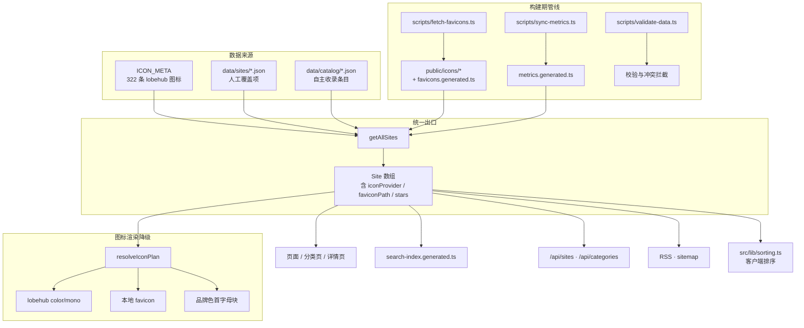

## 产品概述

把本站从「lobehub 图标库的附庸」升级为「能自主收录的 AI 工具导航站」：建立可人工提交、可脚本抓取的收录管线，把条目规模从 322 条扩展到 1000+，并为无 lobehub 图标的新条目提供可用的图标方案，同时引入公开可验证的客观排序维度与社区收录闭环。

## 核心功能

- 自主收录数据源：新增独立于 lobehub 图标库的「收录条目」数据集，与现有派生条目共存，可被同一套校验、搜索、开放 API、RSS、双语链路复用；条目冲突与重复在构建期即可拦截。
- 图标来源放宽：品牌图标改为多级降级（lobehub 彩色 → lobehub 单色 → 本地品牌 favicon → 品牌色首字母块），通过构建期抓取脚本把 favicon 落地到本地目录并生成映射文件；无网络时仍可正常渲染。
- 客观指标接入：为可识别的仓库条目同步 GitHub Star、开源许可、最近更新时间等公开字段，用于展示与排序；不采集任何用户行为，不使用第三方流量估算。
- 中立排序能力：提供默认、最新收录、星标数、名称四种排序，仅改变展示顺序、绝不改变条目集合，且明确标注排序依据来自公开数据。
- 收录闭环：提供结构化提交入口与贡献文档，投稿者按模板填写后由校验脚本自动拦截格式、追踪参数、白名单外的分类与标签。
- 品质审计：新增收录数据审计脚本，输出缺字段、疑似重复、图标缺失、指标过期等清单，支撑持续扩容。

## 视觉与交互效果

- 条目卡片与详情页在原有玻璃拟态风格内新增轻量 Star 徽标，数字以 12.3k 形式简写，无数据时整块不渲染，不产生空占位。
- 列表 / 网格视图的工具栏新增排序下拉控件，与既有视图切换按钮同尺寸、同交互（ghost 风格、hover 底色、可见焦点环），选择结果本地持久化。
- 首页与页脚新增「提交收录」入口，指向结构化投稿模板，移动端保持图标按钮形态不额外占用宽度。
- 图标渲染在多来源降级下保持原有尺寸与不抖动，深浅色主题表现与既有规则一致。

## 技术栈

沿用现有栈，不引入新的运行时依赖：

- Next.js 15 App Router（全站 SSG）+ React 19 + TypeScript
- Tailwind CSS + shadcn/ui 设计令牌
- Zod 数据校验（`src/data/schema.ts`）、tsx 脚本运行时、vitest + jsdom 测试
- 图标来源：`@lobehub/icons-static-svg` 的 unpkg / GitHub raw CDN（现有）+ 本地 `public/icons/`（新增）
- favicon 抓取与指标同步均使用 Node 原生 `fetch`，**不引入 sharp 等图像处理库**（直接落原始 ico/png/svg 文件，`` 可原生渲染）

## 实现方案

### 1. 数据模型：三类来源在 `Site` 边界统一（关键决策）

当前 `getAllSites()` 是 `ICON_META.filter().map()`，条目上限被图标库锁死。做法是新增**独立的收录数据集**，在 `getAllSites()` 里与 lobehub 派生条目合并，**统一输出 `Site[]`**：

- lobehub 派生条目（现有）：`ICON_META` + `data/sites/*.json` 覆盖
- 自主收录条目（新增）：`data/catalog/*.json`，全字段人工维护，非「覆盖项」

这样下游全部链路（页面、分类页、搜索索引、`/api/sites`、`/api/categories`、RSS、sitemap、贡献看板、双语）**无需改动语义**即可自动覆盖新条目，是本方案控制影响面的核心手段。

冲突规则（构建期由 `validate:data` 拦截）：

1. 收录条目的 `id` 不得与派生条目冲突；
2. 收录条目可选填 `iconId`：若该 id 存在于 `ICON_META`，则复用 lobehub 图标（用于「同品牌不同产品」场景），否则走 favicon 降级；
3. 同一 `url` 出现多次时报 warning（沿用现有规则）。

### 2. 图标多级降级（放宽来源）

- `Site` 增加派生字段 `iconProvider: 'lobehub' | 'favicon'` 与 `faviconPath?: string`，与既有 `hasColor` 同为**派生字段，不进 Zod**（维持上一轮约定）。
- `resolveIconPlan()` 扩展候选链：`iconProvider === 'lobehub'` 时沿用现有 color/mono × 双 CDN；否则追加「本地 favicon（img 渲染）」，最后仍以品牌色首字母块兜底。
- favicon 渲染走 ``（品牌色不受主题控制），因此 `iconTileClass()` 的对比垫板逻辑对本地 favicon **同样生效**，无需额外分支。
- `BrandIcon` / `SiteIconTile` 新增可选 props 且带默认值，**保证向后兼容**，未传时行为与当前完全一致。

### 3. favicon 抓取管线

`scripts/fetch-favicons.ts`：

- 只处理 `iconProvider === 'favicon'` 的条目；已抓取且未过期的条目**跳过**（增量缓存）；
- 抓取顺序：`/favicon.ico` → HTML 中的 `link[rel~="icon"]` / `apple-touch-icon`；
- 校验：必须是图片类型、体积 < 80KB、HTTP 200；失败条目跳过并汇总输出，不中断脚本；
- 落盘 `public/icons/<slug>.<ext>`，并生成 `src/data/favicons.generated.ts`（id → 相对路径 / 格式 / 体积）；
- 并发 4、超时 8s（与既有 `check-links.ts` 的并发/超时风格一致），日志复用 `scripts/utils/log.ts`；
- 幂等 + `--check`：生成文件**不得写入每次运行都会变化的字段**（M2 的 `backfill-added-at` 曾因把「生成时间」写进文件导致 `--check` 永远失败，本次必须避免）；
- `public/icons/` 产物入库，保证 SSG 构建与离线环境可用。

### 4. 客观指标同步与排序

`scripts/sync-metrics.ts`：

- 仅处理可从 `url` 推断出 GitHub 仓库（或数据集中显式提供 `repo`）的条目；
- 读取 stars / license / pushedAt / archived 四个公开字段，写入 `src/data/metrics.generated.ts`；
- 未配置 `GITHUB_TOKEN` 时走匿名接口，并发降至 2 并按 `Retry-After` 退避；单次失败只跳过该条；
- **不覆盖**人工维护的 `openSource` / `pricing` 三态字段（仅提供可由 `license` 推出的建议值给审计脚本，保持人机分工）；
- 该脚本不做「值必须一致」的严格 `--check`（数值天然变化），改为 `--check-ids`：只校验生成文件覆盖全部待抓取条目、且格式合法，可安全接入 CI。

排序（新增 `src/lib/sorting.ts`）：

- 四种模式：`default`（现有 order + 名称，**默认值不变，零回归**）、`addedAt`（最新收录）、`stars`（星标降序，无数据条目排后）、`name`（字顺）；
- 纯比较器函数，便于单测；排序在客户端对已加载列表进行（与现有分类筛选、搜索一致的架构），不上服务端、不改变条目集合；
- 偏好复用 `use-stored-state` 持久化，与视图切换、图标风格一致。

### 5. 收录闭环与门禁

- 新增 `.github/ISSUE_TEMPLATE/suggest-tool.yml` 结构化表单（名称 / 官网 / 分类 / 一句话简介 / 定价 / 开源 / 中文支持 / 标签），投稿即形成可校验的录入清单；
- `scripts/validate-data.ts` 扩展：校验 `data/catalog/*.json`（严格字段、https、禁追踪参数、分类与标签白名单、id 唯一、跨文件重复检测）；
- 新增 `scripts/audit-catalog.ts`：输出缺字段、疑似重复、favicon 缺失、指标过期清单，支撑持续扩容；
- 首页与页脚新增「提交收录」入口，指向模板；`CONTRIBUTING.md` 增补「新增收录条目」章节。

### 6. 扩容节奏与构建成本（务必先说明）

- 本轮交付**管线 + 首批种子条目（目标 ≥ 100 条）**；从 100 到 1000 是持续运营动作，靠社区按模板提交 + 审计脚本驱动，不是一次性脚本能刷出来的；
- SSG 页面数将随条目数线性增长（每条约 2 个页面 + 1 个搜索索引条目）。当前 322 条 → 约 680 页；扩到 1000 条 → 约 2000+ 页。需在提交前实测构建耗时；若触及 CI 上限，降级预案为：详情页改为 ISR 增量生成（`revalidate` 已有先例），sitemap 分片。

## 实现注意事项

- **客户端禁止 import `ICON_META`**：这是上一轮已确立的红线，新增字段必须走服务端派生后经 props 下传，否则 322+ 条元数据进入 bundle。
- **向后兼容优先**：所有新增 props / 字段一律可选并带默认值；`resolveIconPlan()` 在未传 `iconProvider` 时必须与当前输出完全一致（现有 11 个单测即为回归护栏）。
- **生成文件入库且幂等**：`favicons.generated.ts`、`metrics.generated.ts` 必须可 `--check`，且不得包含运行时间戳等易变内容；CI 门禁同步接入。
- **无追踪约束不可破**：指标只来自公开 API；不为统计引入任何第三方脚本、不上报用户数据、不做访问量估算。
- **性能**：`getAllSites()` 已有模块级缓存，合并逻辑保持单次 O(n)；避免在循环里做线性查找（`getIconMeta` 已改 Map 索引，新增查找沿用）；排序为客户端 O(n log n)，n ≤ 1000 无压力。
- **双语一致性**：新增 UI 文案必须中英双份；英文站简介仍按 M4 决策回退中文，不新增 `descriptionEn`。
- **SDD 三处同步**：字段变更必须同时改 `src/types/site.ts`、`src/data/schema.ts`、`docs/spec/10-data-model.md`。
- **复用既有范式**：脚本结构对齐 `backfill-added-at.ts` / `build-contributors.ts`（幂等 + `--check` + `utils/log.ts`），不另起一套。

## 架构设计



数据流保持单向：来源在构建期合并校验，客户端只接收 `Site` 纯数据。

## 目录结构

```
项目根/
├── data/
│   └── catalog/                            # [NEW] 自主收录条目数据集（按分类分片，与 data/sites/ 覆盖项分离）
│       ├── chat.json                       # [NEW] 首批种子条目的分片文件，字段完整（非覆盖项）
│       └── ...                             # [NEW] 按分类拆分为多个分片，新增分片需在 registry 登记
├── public/
│   └── icons/                              # [NEW] 构建期抓取的品牌 favicon 落地目录（入库，保证离线可构建）
├── src/
│   ├── data/
│   │   ├── favicons.generated.ts            # [NEW] id → favicon 路径/格式/体积映射（脚本生成，幂等 + --check）
│   │   ├── metrics.generated.ts             # [NEW] id → stars/license/pushedAt/archived（脚本生成）
│   │   ├── schema.ts                        # [MODIFY] 新增 CatalogEntrySchema；SiteSchema 增可选派生字段；保持 strict 约定
│   │   └── registry.ts                      # [MODIFY] 登记 catalog 分片，暴露 CATALOG_ENTRIES 与来源文件名（错误定位用）
│   ├── lib/
│   │   ├── catalog.ts                       # [NEW] 读取并归一化 catalog 条目为 Site（含 iconProvider 推导与去重规则）
│   │   ├── metrics.ts                       # [NEW] 指标访问器与格式化（12.3k 简写、过期判定）
│   │   ├── sorting.ts                       # [NEW] 排序模式与纯比较器（default 行为与现有完全一致）
│   │   ├── sites.ts                         # [MODIFY] getAllSites 合并三类来源；派生 iconProvider/faviconPath/stars
│   │   ├── icon.ts                          # [MODIFY] 新增本地 favicon URL 构造，保留既有 getIconUrl/getIconFallback
│   │   ├── icon-plan.ts                     # [MODIFY] 候选链插入 favicon 层，新增可选入参并保持默认行为不变
│   │   ├── catalog.test.ts                  # [NEW] 归一化、冲突去重、iconProvider 推导单测
│   │   ├── sorting.test.ts                  # [NEW] 四种排序比较器单测（含无数据条目排后）
│   │   └── icon-plan.test.ts                # [MODIFY] 增加 favicon 降级分支用例
│   ├── components/
│   │   ├── site/
│   │   │   ├── brand-icon.tsx               # [MODIFY] 新增可选 iconProvider/faviconPath props，向后兼容
│   │   │   ├── site-icon-tile.tsx           # [MODIFY] 透传新 props，垫板逻辑沿用
│   │   │   ├── site-card.tsx                # [MODIFY] 透传图标来源；接入 Star 徽标
│   │   │   ├── site-row.tsx                 # [MODIFY] 同上
│   │   │   ├── star-count.tsx               # [NEW] Star 徽标，无数据不渲染，避免空占位
│   │   │   └── sort-select.tsx              # [NEW] 排序下拉控件，复用现有按钮尺寸与主题
│   │   ├── layout/site-footer.tsx           # [MODIFY] 新增「提交收录」入口
│   │   └── search/search-dialog.tsx         # [MODIFY] 按新字段渲染 favicon 来源的条目图标
│   ├── app/
│   │   ├── site-view.tsx                    # [MODIFY] 详情页展示图标来源与 Star；透传新 props
│   │   ├── home-explorer.tsx                # [MODIFY] 接入排序控件；catalog 条目参与筛选与排序
│   │   ├── category-filter.tsx              # [MODIFY] 接入排序控件
│   │   └── favorites-view.tsx               # [MODIFY] 保持一致（排序控件可选接入）
│   ├── types/site.ts                        # [MODIFY] Site 增 iconProvider/faviconPath/stars/repo；新增 CatalogEntry 类型
│   └── i18n/dictionaries.ts                 # [MODIFY] 排序、Star、提交收录的中英文案
├── scripts/
│   ├── fetch-favicons.ts                    # [NEW] favicon 抓取（增量缓存、并发 4、超时 8s、幂等 + --check）
│   ├── sync-metrics.ts                      # [NEW] GitHub 公开指标同步（匿名降级、--check-ids 可入 CI）
│   ├── audit-catalog.ts                     # [NEW] 收录数据质量审计（缺字段/重复/favicon 缺失/指标过期）
│   ├── validate-data.ts                     # [MODIFY] 扩展校验 catalog 分片与跨文件冲突
│   ├── build-search-index.ts                # [MODIFY] 产出新增字段（保持索引精简，仅在有值时写入）
│   └── utils/log.ts                         # [MODIFY] 如需要，补充审计结果表格输出
├── .github/
│   ├── ISSUE_TEMPLATE/suggest-tool.yml      # [NEW] 结构化投稿表单
│   └── workflows/ci.yml                     # [MODIFY] 增加 favicons/metrics 的 --check 门禁
├── docs/
│   ├── adr/0009-open-catalog.md             # [NEW] 记录放宽图标来源与自主收录的决策与权衡
│   ├── spec/10-data-model.md                # [MODIFY] 同步 catalog 与新增派生字段
│   └── ROADMAP.md                           # [MODIFY] 新增 M5 章节与长期想法调整
├── CONTRIBUTING.md                          # [MODIFY] 新增「收录新条目」章节与字段规范
├── README.md                                # [MODIFY] 更新收录规模描述与投稿入口
├── CHANGELOG.md                             # [MODIFY] 记录 M5
└── package.json                             # [MODIFY] 新增 fetch:favicons / sync:metrics / audit:catalog 脚本
```

## 关键代码结构

```ts
// src/types/site.ts —— 收录条目：全字段人工维护，与 SiteOverride（可选字段）区分
export interface CatalogEntry {
  id: string;
  /** 可选：复用 lobehub 图标（同品牌不同产品）；留空则走本地 favicon 降级 */
  iconId?: string;
  name: string;
  nameCn?: string;
  url: string;
  category: string;
  tags: string[];
  description: string;
  color: string;
  addedAt: string;
  featured?: boolean;
  order?: number;
  pricing: PricingState;
  openSource: TriState;
  chineseSupport: TriState;
  /** 可选：GitHub 仓库地址，用于同步公开指标 */
  repo?: string;
}
```

```ts
// src/lib/icon-plan.ts —— 新增可选入参，未传时输出与现状完全一致（现有单测即回归护栏）
export function resolveIconPlan(input: {
  iconId: string;
  name: string;
  color: string;
  style: IconStyle;
  hasColor: boolean;
  /** 默认 'lobehub'，保证既有调用点零改动 */
  iconProvider?: 'lobehub' | 'favicon';
  /** provider 为 favicon 时的本地路径，如 /icons/xxx.png */
  faviconPath?: string;
}): { sources: IconSource[]; fallbackUrl: string };
```

```ts
// src/lib/sorting.ts —— 排序仅改变顺序，绝不改变条目集合
export type SortMode = 'default' | 'addedAt' | 'stars' | 'name';
export function sortSites(sites: Site[], mode: SortMode, locale: Locale): Site[];
```

## Agent Extensions

### SubAgent

- **code-explorer**
  - Purpose: 盘点全站对 `iconId`、`getIconMeta`、`SITE_OVERRIDES`、`ICON_META` 的所有引用点（含 server/client 边界），确认把 `iconId` 语义放宽为「可指向 lobehub 或本地 favicon」时的完整影响面
  - Expected outcome: 输出引用清单（文件 + 行号 + 是否客户端组件），确保本次放宽来源后无遗漏调用点、无 ICON_META 泄漏进客户端包

### Skill

- **project-structure**
  - Purpose: 确认 `data/catalog/`、`public/icons/`、`src/lib/catalog.ts`、`src/lib/sorting.ts`、`sort-select.tsx` 等新增文件的落位符合现有就近组织惯例
  - Expected outcome: 目录组织与既有 `data/sites/`、`src/lib`、`src/components/site` 约定一致，不引入新的目录范式

- **lsp-code-analysis**
  - Purpose: 对 `Site` 类型新增字段与 `resolveIconPlan()` 签名变更做引用与实现影响分析（find references / type of）
  - Expected outcome: 精确列出需要同步修改的函数与组件签名，避免类型变更后遗漏调用方导致 typecheck 失败
