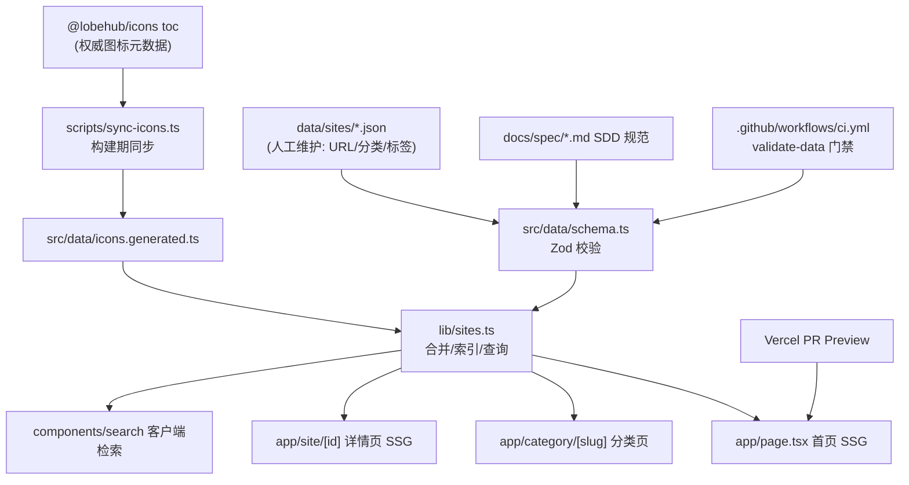

## 产品概述
一个开源、社区驱动的 **AI 工具导航网站**：收录 LobeHub Icons（lobehub.com/icons）中全部 1600+ AI 品牌/模型/应用，为每个条目提供官网直达入口、品牌图标、品牌色、分类与标签。视觉设计参考 ui.lobehub.com 的现代暗色玻璃质感，技术栈为 React（Next.js 15 App Router）。本次交付的是「基础架构搭建」的执行计划，包含工程骨架、数据层、UI 骨架、SDD 规范、开源计划与贡献指引。

## 核心功能
- **全量 AI 站点导航**：以 @lobehub/icons 的 `toc` 元数据为权威来源，覆盖全部 AI 工具/模型/应用条目，每个条目含官网链接、图标、品牌色、分类、标签、简介。
- **分类浏览**：按 group（model / provider / application）与自定义主题分类（对话、图像、视频、编程、Agent、 infra 等）分栏展示卡片网格。
- **即时搜索**：客户端模糊搜索（名称/别名/标签/描述），支持键盘唤起、结果高亮与空态。
- **站点详情页**：单站点介绍页，展示官网直达、关联图标变体、标签与相关推荐，独立 SEO 元数据。
- **主题与响应式**：暗色为主基调，支持亮/暗切换；桌面多列网格、移动单列流式布局。
- **SEO 与可发现性**：全站静态生成（SSG）、sitemap、robots、OG 图、结构化数据（JSON-LD）。
- **社区贡献闭环**：提交新站点模板、数据字段规范、CI 自动校验，新人可零门槛提 PR。

## 范围说明
- 本期聚焦「基础架构 + 规范 + 首页/分类页/详情页骨架 + 开源文档」，不含用户系统、后端服务、付费推荐位。
- 数据以本地 JSON/TS 为主，图标元数据由构建期脚本从 `@lobehub/icons` 的 `toc` 生成，保证与上游图标库同步。


## 技术栈选型
| 层 | 选型 | 理由 |
|---|---|---|
| 框架 | **Next.js 15（App Router）+ React 19 + TypeScript（strict）** | SSG/ISR 利于导航站 SEO；内置 Metadata / `sitemap.ts` / `robots.ts` / Route Handlers |
| 样式 | **Tailwind CSS + shadcn/ui**（CSS 变量主题令牌） | 用户指定；组件可控、主题自由，暗色玻璃质感易实现 |
| 图标 | **@lobehub/icons**（构建期取 `toc` 元数据）+ 静态 SVG CDN | 权威数据源，避免打包 1600+ 组件 |
| 搜索 | Fuse.js（构建期生成轻量索引，按分类分片懒加载） | 1600 条数据客户端检索，无需后端 |
| 数据校验 | **Zod** schema + 脚本校验 | SDD 落地：schema 即规范，数据合规定为 CI 门禁 |
| 质量 | ESLint（flat config）、Prettier、Husky + lint-staged、Commitlint（Conventional Commits）、Vitest + Testing Library | 社区开源标准配置 |
| CI/CD | GitHub Actions（lint / typecheck / test / data-validate / build）+ Vercel（PR 预览 + 生产） | 用户指定 |

## 实现方案
### 核心策略：规范驱动（SDD）的数据优先架构
以「**数据 schema 为契约**」组织整个项目：先写 `docs/spec/*.md` 规格与 `src/types/site.ts` + `src/data/schema.ts`（Zod），再由脚本从 `@lobehub/icons` 的 `toc` 生成图标元数据，最后实现 UI 渲染。所有数据变更必须通过 `pnpm validate:data`，CI 强制门禁，避免脏数据进入仓库。

### 关键技术决策与权衡
1. **图标渲染：CDN 静态 SVG 而非 React 组件全量导入**
   - `toc` 有 1600+ 图标，静态 `import { OpenAI } from '@lobehub/icons'` 全量导入会造成包体与构建时间爆炸。
   - 方案：构建期脚本读取 `toc`，生成 `src/data/icons.generated.ts`（仅元数据：id / title / fullTitle / color / group / param）；运行时用 `getLobeIconCDN(id, { format:'svg', type:'color' })` 生成 URL，通过 `` 或 `next/image`（配置 `remotePatterns`）渲染。
   - 权衡：CDN 依赖外网可用性 → 兜底策略：优先 unpkg，失败降级 GitHub raw，再降级为品牌色首字母占位块；同时提供 `scripts/fetch-icons.ts` 可选地将常用图标落库到 `public/icons/` 实现零外部依赖。
2. **数据组织：权威 toc + 人工精选分层**
   - `src/data/icons.generated.ts`（自动生成，禁止手改）提供 id、官方名、品牌色、group。
   - `data/sites/*.json`（人工维护，按分类分片）提供官网 URL、中文名/别名、分类、标签、简介、是否推荐、排序权重。
   - 运行时 `lib/sites.ts` 做 left-join 合并，产出 `Site[]`；缺失图标的条目在校验阶段报错。
3. **渲染策略：首页 SSG + ISR，详情页 SSG，`generateStaticParams` 全量预渲染**
   - 1600 个详情页全量预渲染可行（每页极小），构建时间可控；详情页设置 `revalidate` 便于数据更新。
4. **性能**
   - 搜索索引按分类分片，首页仅加载全量轻量子集（id/name/tags/url），避免 1600 条完整详情进入首屏 JS。
   - 卡片网格虚拟化/分页（`IntersectionObserver` 增量渲染），图片 `loading="lazy"` + 固定尺寸占位防抖。
   - 时间/空间复杂度：搜索 O(n) 分片内 Fuse 检索（~100-300 条/片），渲染 O(可见项)，避免 O(n²)。

## 实施要点（防回归）
- 依赖：`next` `react` `react-dom` `@lobehub/icons` `zod` `fuse.js` `clsx` `tailwind-merge` `lucide-react` `next-themes`；dev：`typescript` `eslint` `prettier` `husky` `lint-staged` `@commitlint/*` `vitest` `@testing-library/react` `tsx`。
- `next.config.ts` 必须配置 `images.remotePatterns`（raw.githubusercontent.com / unpkg.com / registry.npmmirror.com）。
- Tailwind + shadcn 主题令牌放 `src/app/globals.css` 的 CSS 变量，暗色为默认（`.dark` 与 `:root` 双套令牌），禁止在组件内硬编码颜色。
- 日志：构建脚本用统一 `scripts/utils/log.ts`，仅输出 warn/error 与汇总统计（新增/变更/缺失条目数），不打印整表，避免 CI 日志污染。
- 兼容性：生成文件加 `// @generated` 头部与 `.gitattributes` 标记，PR diff 折叠；手改生成文件由 CI `generate && git diff --exit-code` 拦截。
- 无 secrets：仓库内不含任何 token；Vercel 部署使用项目级环境变量。

## 架构设计



数据流：`toc`（图标/品牌色/官网 desc） → 生成元数据 → 与人工 JSON left-join → `Site[]` → SSG 页面 + 客户端搜索索引。

## 目录结构

```
awosome-ai-tool/
├── docs/
│   ├── spec/
│   │   ├── 00-overview.md            # [NEW] SDD 总纲：规范驱动流程、术语表、变更流程
│   │   ├── 10-data-model.md          # [NEW] Site/Category/Tag/IconMeta 数据规格（字段表+约束+示例）
│   │   ├── 20-architecture.md        # [NEW] 架构决策记录（ADR）：图标CDN、SSG、搜索方案
│   │   ├── 30-ui-design.md           # [NEW] 设计令牌、组件清单、响应式断点、无障碍要求
│   │   └── 40-release.md             # [NEW] 版本号、发布流程、Changelog 规范
│   └── adr/                          # [NEW] 关键决策记录（图标渲染、数据分层、部署）
├── data/
│   ├── sites/                        # [NEW] 按分类分片的人工维护数据（chat.json / image.json / code.json ...）
│   ├── categories.json               # [NEW] 分类定义：slug、名称、图标、排序
│   └── tags.json                     # [NEW] 标签字典（受控词表）
├── scripts/
│   ├── sync-icons.ts                 # [NEW] 读 toc 生成 src/data/icons.generated.ts，输出差异统计
│   ├── validate-data.ts              # [NEW] Zod 校验 + 重复URL/失效id/孤儿分类检查
│   ├── build-search-index.ts         # [NEW] 生成分片搜索索引
│   └── utils/log.ts                  # [NEW] 统一脚本日志（warn/error/汇总）
├── src/
│   ├── app/
│   │   ├── layout.tsx                # [NEW] 根布局：主题、字体、Header/Footer、metadata 基线
│   │   ├── page.tsx                  # [NEW] 首页：Hero + 搜索 + 分类导航 + 卡片网格
│   │   ├── globals.css               # [NEW] Tailwind 指令 + 设计令牌 CSS 变量（明暗双套）
│   │   ├── category/[slug]/page.tsx  # [NEW] 分类页 SSG
│   │   ├── site/[id]/page.tsx        # [NEW] 站点详情页 SSG + generateStaticParams + JSON-LD
│   │   ├── about/page.tsx            # [NEW] 关于/开源说明页
│   │   ├── sitemap.ts                # [NEW] 全站 sitemap
│   │   ├── robots.ts                 # [NEW] robots 规则
│   │   └── opengraph-image.tsx       # [NEW] 动态 OG 图
│   ├── components/
│   │   ├── ui/                       # [NEW] shadcn/ui 基础组件（button/card/input/badge/...）
│   │   ├── layout/                   # [NEW] Header（导航+主题切换）、Footer、Container
│   │   ├── site/                     # [NEW] SiteCard、SiteGrid、BrandIcon（CDN+降级）、CategoryNav
│   │   └── search/                   # [NEW] SearchDialog（⌘K）、SearchResults、空态
│   ├── data/
│   │   ├── schema.ts                 # [NEW] Zod schema（SiteSchema/CategorySchema）+ 类型推导
│   │   └── icons.generated.ts        # [NEW] 自动生成，@generated 标记，禁止手改
│   ├── lib/
│   │   ├── sites.ts                  # [NEW] 数据合并、按分类/标签查询、推荐排序
│   │   ├── icon.ts                   # [NEW] getLobeIconCDN 封装 + 明暗变体 + 降级占位
│   │   ├── search.ts                 # [NEW] Fuse 索引构建与分片查询
│   │   ├── seo.ts                    # [NEW] metadata 生成、JSON-LD 构造
│   │   └── utils.ts                  # [NEW] cn() 等工具
│   └── types/site.ts                 # [NEW] Site / Category / Tag / IconMeta 类型契约
├── .github/
│   ├── ISSUE_TEMPLATE/               # [NEW] new-site.yml（提交新站点）、bug_report.yml、icon-request.yml、feature_request.yml
│   ├── PULL_REQUEST_TEMPLATE.md      # [NEW] PR 检查清单（数据校验通过、截图、关联 Issue）
│   ├── workflows/ci.yml              # [NEW] lint/typecheck/test/validate-data/build
│   ├── workflows/sync-icons.yml      # [NEW] 定时同步上游图标并自动开 PR
│   ├── CODEOWNERS                    # [NEW] 数据与规范文件的 owner
│   └── FUNDING.yml                   # [NEW] 赞助入口（可选）
├── CONTRIBUTING.md                   # [NEW] 贡献指引：本地开发、新增站点步骤、字段规范、commit 规范、PR 流程
├── README.md                         # [NEW] 项目介绍、特性、快速开始、目录说明、徽章、路线图
├── ROADMAP.md                        # [NEW] 分阶段路线图与里程碑
├── CODE_OF_CONDUCT.md                # [NEW] 贡献者行为准则（Contributor Covenant）
├── SECURITY.md                       # [NEW] 安全策略与漏洞披露流程
├── CHANGELOG.md                      # [NEW] 变更日志
├── LICENSE                           # [NEW] MIT 许可证
├── package.json / tsconfig.json / next.config.ts / tailwind.config.ts / components.json
├── .editorconfig / .prettierrc / eslint.config.mjs / commitlint.config.ts / .gitignore / .gitattributes
└── vitest.config.ts                  # [NEW] 单元测试配置（覆盖 lib 与 schema）
```

## 关键代码结构

```ts
// src/types/site.ts —— 全项目数据契约（SDD 核心，schema 与文档均以此为准）
export type IconGroup = 'model' | 'provider' | 'application';

export interface IconMeta {
  id: string;          // PascalCase，如 "OpenAI"，对应小写 CDN slug
  title: string;
  fullTitle: string;
  color: string;       // 品牌 hex
  group: IconGroup;
  param: Record<'hasColor'|'hasBrand'|'hasText'|'hasTextCn'|'hasCombine'|'hasAvatar', boolean>;
}

export interface Site {
  id: string;          // 必须与 IconMeta.id 或小写 slug 对齐
  iconId: string;      // 映射到 @lobehub/icons 的 id
  name: string;
  nameCn?: string;
  url: string;         // 官网，https、无 tracking 参数
  category: string;    // 必须存在于 categories.json
  tags: string[];      // 必须存在于 tags.json（受控词表）
  description: string; // ≤ 80 字
  featured?: boolean;
  order?: number;
}
```

```ts
// src/lib/icon.ts —— 图标 URL 与降级策略契约
export interface IconOptions { type?: 'color' | 'mono' | 'brand' | 'text'; isDark?: boolean }
export function getIconUrl(iconId: string, opts?: IconOptions): string;   // 优先 unpkg SVG
export function getIconFallback(iconId: string, brandColor: string): string; // 品牌色首字母占位 data-uri
```


## 设计风格
采用 **LobeHub 灵感的暗色玻璃拟态（Dark Glassmorphism）+ 品牌色微光** 风格：深空底色叠加大范围柔和光斑渐变，卡片使用半透明毛玻璃与 1px 内发光描边，图标以品牌色作为悬停光晕来源。整体质感克制、高级，避免花哨；亮色模式下切换为浅灰白底 + 同构卡片。所有交互动效控制在 150-250ms 的 ease-out。

## 页面规划（3 个核心页面）

### 1. 首页 `/`（导航主页）
- **顶部导航栏**：左为 Logo + 站点名，中为分类快捷锚点，右为搜索入口（⌘K 徽标）、主题切换、GitHub 星标按钮；滚动后背景转为毛玻璃吸顶。
- **Hero 区块**：大标题 + 副标题 + 数据中统计（收录站点数/分类数），背景是品牌色渐变光斑与细微网格纹理，标题带渐变文字。
- **搜索与筛选区块**：居中大搜索框（圆角胶囊、聚焦时品牌色发光描边），下方为分类 Chip 横滑条与标签快捷筛选，实时显示「命中 N 个工具」。
- **分类卡片网格区块**：按分类分栏，每栏为响应式卡片网格（桌面 4-6 列）；卡片含品牌图标（悬停放大 + 品牌色光晕）、名称、一句话描述、标签徽章；点击整卡直达官网，右下角悬停出现「外链」图标。
- **页脚区块**：开源信息、贡献入口、许可证、友链与统计数字。

### 2. 分类页 `/category/[slug]`
- 复用顶部导航栏与页脚。
- **分类头部**：大号分类图标 + 分类名 + 描述 + 该分类条目数。
- **筛选与排序工具条**：标签多选、排序（推荐/名称/最新收录）、视图切换（网格/列表）。
- **条目网格**：与首页卡片同构，列表视图显示更宽的一行式条目（图标 + 名称 + 描述 + 直达按钮）。
- **空态与相关分类推荐**：无结果时展示空插画与「看看其他分类」。

### 3. 站点详情页 `/site/[id]`
- **面包屑与返回**：面包屑导航 + 返回上级分类。
- **详情头部卡片**：大尺寸品牌图标（品牌色渐变底）、中英文名、官网直达主按钮、收藏/复制链接次按钮、标签徽章组。
- **详情内容区**：简介、亮点特性列表、关联的图标变体展示（mono/color/brand）。
- **相关推荐区块**：同分类/同标签的站点卡片横向滚动列表。
- **数据来源与贡献区块**：标注图标与数据来源（LobeHub Icons，附链接）与「发现信息有误？提交更正」入口。

## 响应式与无障碍
- 断点：移动单列（<640）、平板 2-3 列（640-1024）、桌面 4-6 列（>1280），容器最大宽 1280px 居中。
- 对比度满足 WCAG AA；图标与链接均有 aria-label；卡片为可聚焦的 `<a>`，支持键盘 Tab 与 Enter；`prefers-reduced-motion` 时关闭动效。


## Agent Extensions
### Skill
- **project-structure**
  - Purpose: 在初始化阶段校验并优化目录划分（数据层 / 组件层 / 脚本层 / 文档层），避免数据与组件错位、colocation 反模式
  - Expected outcome: 产出与上述目录结构一致、层次清晰的工程骨架，数据与 UI 职责边界明确
- **content-creation**
  - Purpose: 撰写 README、ROADMAP、CONTRIBUTING 等开源文案，保证对外表达专业、结构统一、易于社区理解
  - Expected outcome: 完整的开源文档集，含项目介绍、快速开始、贡献步骤与路线图
