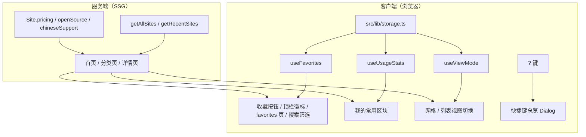

## 产品概述

完成 ROADMAP「M3 · 体验增强（v0.3.x）」的 5 项迭代，目标是在纯静态、无账号的前提下，为用户提供「个人化」与「更顺手」的浏览体验：能把工具收起来、能快速找回常用工具、能在详情页一眼看懂定价与开源/中文支持、能用键盘完成主要操作、能自选列表或网格视图。

## 核心特性

1. **收藏夹**：卡片上的收藏按钮、顶栏收藏入口（带数量徽标）、独立收藏页 `/favorites`、⌘K 搜索面板内「只看收藏」筛选；数据存于 localStorage，无需登录。
2. **我的常用（本地热度榜）**：基于本地「访问详情页 / 点击官网直达 / 收藏」加权统计排序，仅本人可见，区块标题明确标注「我的常用」，无数据时整块隐藏。
3. **详情页元信息**：新增定价、是否开源、是否支持中文三个结构化字段，详情页以徽标组展示，未填写时显示「待补充」；已有 `free` / `open-source` / `chinese` 标签自动迁移为字段初值。
4. **键盘快捷键总览与无障碍走查**：`?` 键唤起快捷键总览弹窗；系统性无障碍走查并**修复**发现的问题（对比度、aria、焦点管理、键盘可达、语义结构、动效降级）。
5. **列表 / 网格视图**：首页与分类页共用视图切换，列表为真正的紧凑行式布局（非卡片堆叠），选择持久化到 localStorage。

## 已确认的实现取向

- 元信息采用新增结构化字段并迁移既有标签，避免标签语义与展示语义混杂。
- 收藏夹交付完整能力（按钮 + 顶栏入口 + 收藏页 + 搜索内筛选）。
- 热度榜仅做本地「我的常用」，不做全站追踪式热度，符合项目「无用户行为追踪」约束。
- 视图切换与无障碍均按全量范围交付（含走查修复）。

## 技术栈

沿用项目现有技术栈，**不引入新依赖**：

- Next.js 15 App Router（全站 SSG，`revalidate = 3600`）+ React 19 + TypeScript
- Tailwind CSS + shadcn/ui（`button` / `badge` / `dialog` 等已有组件），设计令牌 `glass-card` / `gradient-text` / `animate-aurora-shift`
- Zod（`src/data/schema.ts` 运行时校验）、tsx（脚本运行时）、vitest + jsdom + @testing-library/react（单测）
- 浏览器原生 `localStorage` + `storage` 事件（跨 Tab 同步），无后端、无第三方统计

## 实现方案

### 1. 数据模型：新增元信息字段（三处同步）

在 `Site` 与 `SiteOverride` 上新增三个字段，并按 SDD 要求同步 `src/types/site.ts`、`src/data/schema.ts`、`docs/spec/10-data-model.md`：

- `pricing`：`'free' | 'freemium' | 'paid' | 'unknown'`（枚举，缺省 `unknown`，避免用 `false` 表达「未填」）
- `openSource`：`boolean | 'unknown'`（或拆为 `openSource: boolean` + 缺省 `unknown` 三态，实现上统一用 `OpenSourceState = 'yes' | 'no' | 'unknown'` 更易读屏与展示）
- `chineseSupport`：同 `openSource` 的三态设计

**关键点**：`SiteOverrideSchema` 是 `.strict()`，新增字段必须登记，否则既有 243 条覆盖项会校验失败；`SiteSchema` 同理需补字段并约束枚举值。

### 2. 一次性标签迁移脚本

新增 `scripts/migrate-meta.ts`（`pnpm migrate:meta`）：

- 扫描 `data/sites/*.json`，把条目 `tags` 中的 `free` → `pricing: 'free'`、`open-source` → `openSource: 'yes'`、`chinese` → `chineseSupport: 'yes'`；
- **迁移后从条目 `tags` 中移除这三个标签**，避免详情页元信息与标签区重复展示；
- 幂等（重复执行结果不变）、可审计（输出迁移条目数与各字段计数），支持 `--check` 供 CI 校验；
- 迁移后需决定 `data/tags.json` 是否移除这三个词表项（建议保留 `free` 以外两个为历史兼容，或按迁移结果统一移除并同步 `validate:data` 的未登记标签校验）——计划中给出结论：迁移完成后从词表移除这三个标签，因为它们已由结构化字段承载，继续留在词表会导致两种表达方式并存。

### 3. 客户端存储层与 hooks

新增 `src/lib/storage.ts`：

- 统一前缀与版本号（如 `ait:v1:favorites`），便于后续迁移与清理；
- SSR 守卫（`typeof window === 'undefined'` 返回兜底值），`try/catch` 覆盖隐私模式 / 配额超限；
- 读写均为纯函数 + 泛型（`readJson<T>(key, fallback)` / `writeJson(key, value)`）。

配套 hooks（建议放 `src/lib/` 或就近 `src/components/` 下的 hooks 目录，由 project-structure 确认）：

- `useFavorites()`：`{ ids, has, toggle, ready }`，跨 Tab 通过 `storage` 事件同步；
- `useUsageStats()`：`{ recordVisit(id), recordOutbound(id), top(limit) }`，本地计数 + 时间衰减或简单加权（收藏权重 > 点击）；
- `useViewMode()`：`{ view, setView, ready }`，持久化且 hydration 安全。

### 4. hydration 安全策略（关键难点）

收藏态、统计、视图模式均来自 localStorage，服务端渲染时不可用。统一策略：

- **首屏以「服务端可确定的默认态」渲染**（如未收藏、grid 视图、`ready = false`）；
- 组件挂载后（`useEffect`）读取本地数据并更新，`ready` 置真后再渲染依赖本地数据的区块（「我的常用」、收藏页列表）；
- 视图模式：首屏统一渲染 grid，挂载后若本地为 list 再切换，配合 `ready` 抑制闪烁（避免布局跳变与 hydration mismatch）；
- 收藏按钮在 `ready` 前渲染为禁用或中性态，避免图标闪烁。

### 5. 收藏按钮与卡片链接的嵌套冲突（关键难点）

`SiteCard` 当前整卡是一个 `<Link>`，直接内嵌 `<button>` 会形成交互元素嵌套（非法 HTML、键盘与读屏体验差）。方案：

- 将 `SiteCard` 重构为「相对定位容器 + stretched-link」结构：主链接用 `absolute inset-0` 覆盖层（带 `aria-label`），收藏按钮以更高 `z-index` 置于覆盖层之外，二者为兄弟节点而非父子；
- 收藏按钮需 `aria-pressed`、`aria-label`（如「收藏 OpenAI」/「取消收藏 OpenAI」）与可见焦点环；
- 收藏交互需 `stopPropagation` 与 `preventDefault`，避免触发卡片跳转。

### 6. 点击统计埋点口径

明确「点击」定义并只写 localStorage：

- `recordVisit(id)`：进入详情页时记录（详情页为客户端边界时可在卡片点击/详情页挂载时触发）；
- `recordOutbound(id)`：点击「官网直达」按钮时记录，权重高于 visit；
- 收藏权重最高；综合得分排序产出「我的常用」，无数据则整块隐藏。

### 7. 视图切换（首页 + 分类页共用）

- 抽出共享的 `SiteViewToggle` 与列表行组件 `SiteRow`（真正行式布局：图标 + 名称 + 简介 + 标签 + 收藏按钮，单行紧凑）；
- `category-filter.tsx` 改用共享组件，首页 `HomeExplorer` 增加同一套切换（含持久化）；
- 现有分类页 list 视图（卡片塞进 `li`）替换为 `SiteRow`。

### 8. 快捷键总览与无障碍

- `?`（Shift+/）唤起快捷键总览 Dialog，列出 ⌘K 搜索、↑↓ 选择、Enter 打开、Esc 关闭、`?` 总览等；全局监听需排除输入态（`input` / `textarea` / `contenteditable`）避免误触发；
- 无障碍走查：系统性检查语义结构、`aria-label`、可见焦点环、键盘可达顺序、对比度、`prefers-reduced-motion` 降级，产出报告到 `docs/`，并**修复**发现的问题。

## 实现注意事项

- 字段变更三处同步（types / Zod / `docs/spec/10-data-model.md`），改完必须 `pnpm validate:data` + `pnpm build:search`（生成文件入库，CI 有 `git diff --exit-code` 门禁）+ `pnpm test`。
- 迁移脚本必须幂等且可重跑；执行后核对 `git diff` 再进入下一步。
- 所有客户端本地数据读取必须 SSR 守卫，禁止在渲染期直接访问 `localStorage`（会破坏 SSG 与 hydration）。
- `/favorites` 页内容来自 localStorage，无法 SSG 出真实条目，需处理加载前占位与空态，并考虑 `noindex` 等 SEO 取舍。
- 收藏统计与热度数据仅存本地，不引入任何第三方统计脚本（项目「不做什么」明确禁止）。
- 新增组件需补充单测（storage 读写、hooks 行为、字段合并优先级），沿用 vitest + @testing-library/react 现有模式。
- 提交前跑完整 CI 链路：`format:check` → `lint` → `typecheck` → `validate:data` → `test` → `backfill:added-at --check` → `build:search` → `next build`（322 页预渲染）。

## 架构设计



数据分层保持不变（上游元数据 + 人工覆盖项 → `Site[]`），本地个性化数据完全在客户端叠加，不回流到 SSG 产物。

## 目录结构

```
项目根/
├── src/
│   ├── types/site.ts                      # [MODIFY] 新增 pricing / openSource / chineseSupport 及枚举类型（SDD 类型层）
│   ├── data/
│   │   └── schema.ts                      # [MODIFY] Site / SiteOverride 新增元信息字段（strict 模式必须同步）
│   ├── lib/
│   │   ├── sites.ts                       # [MODIFY] buildSite 合并元信息字段（覆盖项 > 派生 unknown）
│   │   ├── storage.ts                     # [NEW] localStorage 安全读写、版本化 key、SSR 守卫、异常降级
│   │   ├── favorites.ts                   # [NEW] useFavorites hook（收藏集合、切换、跨 Tab 同步）
│   │   ├── usage.ts                       # [NEW] useUsageStats hook（访问/外链/收藏加权统计与排序）
│   │   ├── view-mode.ts                   # [NEW] useViewMode hook（网格/列表持久化，hydration 安全）
│   │   ├── storage.test.ts                # [NEW] 存储层与 hooks 单测
│   │   └── sites.test.ts                  # [MODIFY] 补充元信息字段合并与迁移后数据用例
│   ├── components/
│   │   ├── site/
│   │   │   ├── site-card.tsx              # [MODIFY] 重构为容器 + stretched-link，腾出收藏按钮位置
│   │   │   ├── favorite-button.tsx         # [NEW] 收藏按钮（aria-pressed、焦点环、阻止冒泡）
│   │   │   ├── site-row.tsx                # [NEW] 列表视图行式布局（图标+名称+简介+标签+收藏）
│   │   │   └── site-view-toggle.tsx        # [NEW] 网格/列表切换按钮组（供首页与分类页共用）
│   │   ├── search/
│   │   │   └── search-dialog.tsx           # [MODIFY] 增加「只看收藏」筛选与空态
│   │   ├── shortcuts/
│   │   │   └── shortcuts-dialog.tsx        # [NEW] ? 键快捷键总览弹窗
│   │   └── layout/
│   │       └── site-header.tsx             # [MODIFY] 增加收藏入口（数量徽标）
│   └── app/
│       ├── page.tsx                        # [MODIFY] 引入我的常用区块与视图切换上下文
│       ├── home-explorer.tsx               # [MODIFY] 接入视图切换与列表布局
│       ├── home-my-favorites.tsx           # [NEW] 「我的常用」区块（无数据隐藏）
│       ├── favorites/page.tsx              # [NEW] 收藏页（客户端渲染 + 空态 + noindex 取舍）
│       └── category/[slug]/category-filter.tsx # [MODIFY] 改用共享视图切换与 SiteRow
├── scripts/
│   └── migrate-meta.ts                     # [NEW] 标签 → 元信息字段迁移（幂等，支持 --check）
├── data/
│   ├── sites/*.json                        # [MODIFY] 迁移写入元信息字段并移除对应标签
│   └── tags.json                           # [MODIFY] 移除已由字段承载的 free / open-source / chinese
└── docs/
    ├── spec/10-data-model.md               # [MODIFY] 新增元信息字段与校验规则（权威定义必须同步）
    ├── a11y/accessibility-audit.md         # [NEW] 无障碍走查报告
    ├── ROADMAP.md                          # [MODIFY] 勾选 M3 完成项
    └── CHANGELOG.md                        # [MODIFY] 记录 v0.3.x 变更
```

## 关键代码结构

```ts
// src/types/site.ts —— 元信息字段（其余字段保持不变）
export type PricingState = 'free' | 'freemium' | 'paid' | 'unknown';
export type TriState = 'yes' | 'no' | 'unknown';

export interface Site {
  // ...既有字段（含 M2 的 addedAt）
  /** 定价模式，缺省 unknown 表示待补充 */
  pricing: PricingState;
  /** 是否开源 */
  openSource: TriState;
  /** 是否支持中文 */
  chineseSupport: TriState;
}

export interface SiteOverride {
  iconId: string;
  // ...既有可选字段
  pricing?: PricingState;
  openSource?: TriState;
  chineseSupport?: TriState;
}
```

```ts
// src/lib/storage.ts —— 本地存储抽象（SSR 守卫 + 版本化 key + 异常降级）
export function readJson<T>(key: string, fallback: T): T;
export function writeJson(key: string, value: unknown): boolean;
export function subscribe(key: string, listener: () => void): () => void;
```

```ts
// 客户端 hooks 约定
export function useFavorites(): {
  ids: string[];
  has: (id: string) => boolean;
  toggle: (id: string) => void;
  ready: boolean;
};

export function useUsageStats(): {
  recordVisit: (id: string) => void;
  recordOutbound: (id: string) => void;
  top: (limit?: number) => string[];
  ready: boolean;
};

export function useViewMode(): {
  view: 'grid' | 'list';
  setView: (view: 'grid' | 'list') => void;
  ready: boolean;
};
```

## 设计定位

M3 只在现有「深色玻璃拟态 + 渐变光斑」设计语言内新增交互层，不引入新设计体系。新增元素（收藏按钮、收藏入口、我的常用区块、视图切换、列表行、快捷键弹窗、详情页元信息徽标）在间距、圆角、hover 抬升与发光描边上与 Hero、编辑精选、分类网格保持完全一致。

## 分块设计

### 1. 收藏按钮（卡片右上角）

- 未收藏：心形描边图标， muted 前景，hover 时转为主色并轻微放大；已收藏：主色实心 + 微弱发光（`shadow-glow`）。
- 置于卡片 stretched-link 覆盖层之上（`z-20`），尺寸 28px 圆形玻璃底，保证移动端可点。
- 状态语义通过 `aria-pressed` 与动态 `aria-label` 暴露，焦点环可见。

### 2. 顶栏收藏入口

- 位于搜索按钮与主题切换之间，心形图标 + 数量徽标（Badge，主色底），数量为 0 时徽标隐藏。
- 与现有 ⌘K 按钮同高度同圆角，移动端保留图标形态。

### 3. 「我的常用」区块（首页）

- 与 M2「本周新增」区块同构：标题行（Sparkles 图标 + 标题 + 副标题「按你的访问与收藏排序」）+ 右侧数量徽标。
- 复用相同响应式网格（1/2/3/4 列）与 `SiteCard`；有排序序号时可在卡片左上角叠加极淡的序号徽标。
- 无本地数据时整块不渲染；`ready` 为假时渲染等高占位骨架，避免布局跳动。

### 4. 视图切换与列表行

- 切换控件沿用分类页现有图标按钮组（`LayoutGrid` / `Rows3`），选中态为 `secondary` 变体，置于筛选工具条右侧。
- 列表行 `SiteRow`：单行紧凑布局，左侧图标 + 主名称（中文名优先）/ 英文名，中间单行截断简介，右侧标签与收藏按钮；整行 hover 抬升 + 主色描边，行高与卡片网格视觉密度协调。

### 5. 详情页元信息徽标组

- Hero 内标题下方新增一行徽标：定价（free / freemium / paid）、开源（是/否）、中文支持（是/否）。
- 已知值用语义化配色（免费绿、付费橙、开源主色、中文强调色）；未知值统一为中性徽标 + 文案「待补充」，不显示 `false` 或空白。

### 6. 快捷键总览弹窗

- 复用 `Dialog`，标题「键盘快捷键」，内容为每个快捷键一行：左侧说明、右侧 `<kbd>` 键位（沿用顶栏 ⌘K 的 kbd 样式）。
- 底部提示与搜索面板一致（`Esc` 关闭），焦点自动进入弹窗、关闭后归还。

### 7. 收藏页

- 与首页 explorer 同构的空态：玻璃卡片居中的标题 + 说明 + 「去首页逛逛」按钮；有数据时沿用网格/列表视图切换。
- 顶部提供清空收藏的二次确认入口（destructive 变体），避免误操作。

## 动效原则

沿用既有微动效：hover 抬升 0.5、图标缩放、发光描边；收藏切换增加一次极轻的弹跳；全部动效在 `prefers-reduced-motion: reduce` 下降级为无动画。

## Agent Extensions

### SubAgent

- **code-explorer**
  - Purpose: 系统性走查全站无障碍问题（aria 缺失、对比度风险、键盘不可达元素、语义结构），并定位收藏按钮需插入的所有卡片调用点
  - Expected outcome: 输出 `docs/a11y/accessibility-audit.md` 走查清单（含文件与行号），以及收藏按钮需改造的组件清单

### Skill

- **project-structure**
  - Purpose: 确认新增文件（`src/lib/storage.ts`、hooks、`/favorites` 页、`src/components/shortcuts/`、列表行组件）的落位符合现有就近组织惯例
  - Expected outcome: 文件放置与既有 `src/lib`、`src/components/site`、`src/app` 约定一致，不引入新的目录范式
