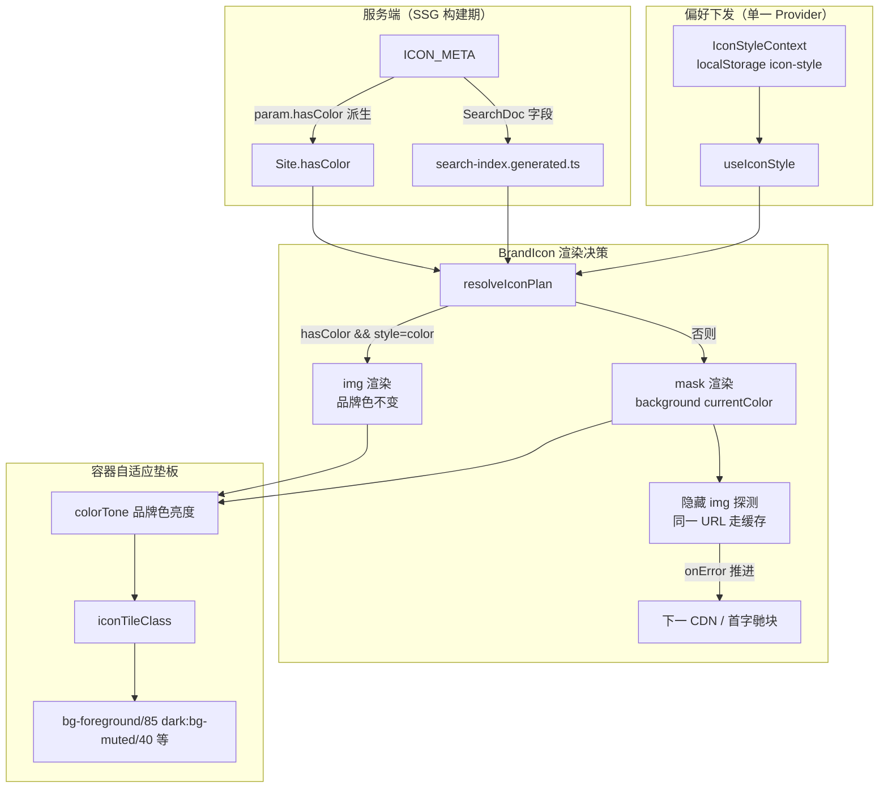

## 产品概述

对齐 lobehub 的图标主题机制（图标以 `currentColor` 着色、随主题文字色翻转，品牌固定色不变），修复本站图标在深色/浅色模式下的可见性问题，并顺带消除无效请求与图标闪烁，同时提供「彩色 / 单色」全局风格开关。

## 核心特性

1. **单色图标跟随主题**：105 个无彩色变体的图标（OpenAI、Anthropic 等）改为 mask + `currentColor` 着色，浅色模式呈深灰黑、深色模式呈近白，主题切换带 200ms 过渡，与参考站表现一致。
2. **品牌彩色图标保持原色**：217 个有彩色变体的条目继续以原品牌色渲染（Claude 橙、Microsoft 蓝），不随主题变化。
3. **极端品牌色的容器自适应垫板**：对白色/极浅品牌色（65 条，如 Azure、Copilot、Civitai）在浅色模式下自动加深色垫板，深色品牌色在深色模式下自动加浅色垫板，保证任意主题下图标与背景都有对比；品牌色辉光效果保留。
4. **图标加载链修复**：卡片、列表、搜索面板、相关推荐补齐 `hasColor` 判定，消除每个图标 2 次无效 CDN 请求与加载闪烁；搜索面板不再硬编码兜底色。
5. **彩色 / 单色风格开关**：顶栏新增图标风格切换按钮，偏好写入 localStorage 与跨标签页同步；「单色」模式下全站图标统一为跟随主题的线条风格。

## 技术栈

沿用现有技术栈，不引入新依赖：

- Next.js 15 App Router（全站 SSG）+ React 19 + TypeScript
- Tailwind CSS（`darkMode: ['class']`，`hsl(var(--*))` 令牌）+ shadcn/ui
- Zod（数据校验）、tsx（脚本运行时）、vitest + jsdom（测试）
- 图标来源维持现状：`@lobehub/icons-static-svg` 的 unpkg / GitHub raw CDN 三级降级

## 实现方案

### 1. 上游机制结论（curl 实测，方案的事实基础）

```
openai.svg      → <svg fill="currentColor" ...>      // mono 变体以 currentColor 着色
openai-color.svg → 404 Not found                      // OpenAI 根本没有彩色变体
```

lobehub 官网把图标内联为 React SVG，因此 `currentColor` 能跟随 CSS `color`（浅色近黑、深色近白）；品牌固定色是写死的 hex，不随主题变。

本站 `` 引用的 SVG 是**独立文档**，`currentColor` 继承不到页面颜色而回退为默认黑色 —— 这正是深色模式下 105 个单色图标"黑贴黑"的根因。要复刻参考站效果，必须让单色图标回到"可继承颜色"的渲染方式，同时**不能**把 `` 换成 npm 组件包（会把 322 个图标组件打进 bundle，并推翻 ADR 0001 的 CDN 策略）。

### 2. 决策：mask + currentColor 渲染单色图标

```html
<span
  style="background-color: currentColor;
             mask-image: url(icon.svg); mask-size: contain;
             mask-repeat: no-repeat; mask-position: center;
             -webkit-mask-image: url(icon.svg)"
>
  <!-- Safari 前缀必须带 --></span
>
```

- mask 的产物即 `:after` 形状的纯色块，`background-color: currentColor` 继承 `body` 的 `--foreground` → 浅色 `#1B1B22` 级近黑、深色 `#F2F2F5` 级近白，与参考站一致；加 `transition-colors duration-200` 得到平滑主题过渡。
- 彩色图标**继续用 ``**（品牌色不能被 currentColor 污染）。
- 排除方案：`` + `dark:invert` 属于补丁式，一旦上游 mono 不再是纯色就会整体失真；`@lobehub/icons` npm 组件包会造成 bundle 膨胀并推翻既有 ADR。

### 3. 关键难点：mask 加载失败没有 onError 事件

CSS `mask-image` 请求失败不会触发任何 DOM 事件，直接换渲染方式会让现有三级降级（unpkg → GitHub raw → 品牌色首字母块）失效。

解法：**mask 元素旁保留一个视觉隐藏的探测 ``**（`absolute inset-0 opacity-0`，`aria-hidden`）。

- 它与 mask 使用**同一个 URL**，浏览器缓存复用，**不产生额外请求**；
- `onError` 推进候选下标到下一个 CDN / 下一个变体，`onLoad` 标记该 URL 可用；
- 全部候选失败后 `failed` 为真，切换回 ``（首字母块）。
- 网络开销对比修复前：105 条无彩色变体的条目原本每条要打 2 次 404，修复后为 0。

### 4. 渲染决策纯函数（SoC，便于单测）

抽出 `resolveIconPlan()`，组件只负责渲染：

```ts
// src/lib/icon-plan.ts
export type IconRenderMode = 'img' | 'mask' | 'fallback';
export interface IconSource {
  url: string;
  mode: Exclude<IconRenderMode, 'fallback'>;
}

/** 按风格偏好与变体可用性，给出按优先级排列的渲染候选 */
export function resolveIconPlan(input: {
  iconId: string;
  name: string;
  color: string;
  style: IconStyle;
  hasColor: boolean;
}): { sources: IconSource[]; fallbackUrl: string };
```

规则：

| 风格 | hasColor | 候选序列                                                                                |
| ---- | -------- | --------------------------------------------------------------------------------------- |
| 彩色 | true     | unpkg/color → github/color（img 渲染）→ unpkg/mono → github/mono（mask 渲染）→ 首字母块 |
| 彩色 | false    | unpkg/mono → github/mono（mask）→ 首字母块                                              |
| 单色 | 任意     | unpkg/mono → github/mono（mask）→ 首字母块                                              |

### 5. 容器自适应垫板（Q2）

新增纯函数 `src/lib/color.ts` 计算 WCAG 相对亮度，再由 `iconTileClass()` 产出可直接进 className 的类名组合；由于 `darkMode: ['class']`，主题分支全部由 CSS 完成，**组件无需感知当前主题**。

```ts
// src/lib/color.ts
export type Tone = 'light' | 'dark' | 'normal';
export function hexToRgb(hex: string): { r: number; g: number; b: number } | null;
export function relativeLuminance(hex: string): number; // 0（黑）~ 1（白）
export function colorTone(hex: string): Tone; // ≥0.8 light / ≤0.15 dark / 其余 normal
```

```ts
// 垫板策略：只有「不受主题控制的 img 渲染」才需要垫板；mask 渲染天然可见
export function iconTileClass(input: { color: string; mode: IconRenderMode }): string;
```

- `tone === 'light'` 且 img 渲染：`bg-foreground/85 dark:bg-muted/40`（浅色模式给深色垫板让白图标可见）
- `tone === 'dark'` 且 img 渲染：`bg-muted/40 dark:bg-primary-foreground/90`（深色模式给浅色垫板让黑图标可见）
- `tone === 'normal'` 或 mask 渲染：维持现有 `bg-muted/40`
- 品牌色辉光 `boxShadow: 0 ... ${site.color}` **保留不变**
- 抽为 `src/components/site/site-icon-tile.tsx` 供四类容器复用（DRY，消除 site-card / site-row / site-view 的重复容器代码）

### 6. hasColor 的服务端派生与 bundle 隔离（Q3）

`BrandIcon` 是 `'use client'`，若在客户端 import `getIconMeta` / `ICON_META`，会把 322 条元数据打进客户端 bundle（约 60–70 KB）。因此采取**服务端派生 + props 下传**：

- `buildSite()` 追加派生 `hasColor: meta.param.hasColor`（写法照搬既有派生字段 `curated: Boolean(override)`，但**不入 `SiteOverride` / Zod**，因为它 100% 由上游派生、不可覆盖，加入反而破坏「override 必须与 Zod 一致」的约定）；
- 数据模型变更同步 `src/types/site.ts` 与 `docs/spec/10-data-model.md` 两处即可（并在文档中标注为派生字段）；
- `getIconMeta` 的线性查找改为一次性构建的 `Map`（`src/lib/sites.ts` 内部），避免列表渲染里 322×322 次遍历；
- 调用点补齐：`site-card.tsx` L53、`site-row.tsx` L32、`site-view.tsx` L187（相关推荐）传入 `hasColor`；`site-view.tsx` L83 的 `meta?.param.hasColor ?? true` 统一改为读 `site.hasColor`；
- 搜索面板：给 `SearchDoc` 增加 `hasColor: boolean` 与 `color: string`（替代硬编码 `#6e56f8`），`scripts/build-search-index.ts` 同步产出字段，重跑 `pnpm build:search` 重新生成 `src/data/search-index.generated.ts`（入库）。索引体积增量约 +8 KB（未压缩），客户端按需 fetch，不影响首屏 JS。

### 7. 图标风格开关（Q4）

- 新增 `src/lib/icon-style.ts`：`IconStyle = 'color' | 'mono'`、`useIconStyleState()`，基于 `useStoredState<IconStyle>(STORAGE_KEYS.iconStyle, 'color')`；`STORAGE_KEYS` 追加 `iconStyle: 'icon-style'`（`PREFIX = 'ait:v1:'` 自动生效）。
- **状态必须经过单一 Provider 下发**：322 张卡片若各自跑一次 hook，会产生 322 次 `localStorage.getItem` + `JSON.parse` + 322 个 `storage` 订阅。因此遵循 `personalization-provider.tsx` 既有范式，在该文件内扩展第三个 Context（`IconStyleContext`）+ `useIconStyle()`（**Context 优先、Provider 外降级为本地状态**，与 `useFavorites` 完全对称）。文件注释由「收藏夹与使用统计」微调为「个性化偏好与本地数据 Provider」。
- UI 新增 `src/components/site/icon-style-toggle.tsx`：lucide `Palette`（彩色）/ `Circle`（单色）图标切换，ghost 图标按钮，置于 `site-header.tsx` 右侧按钮组中 ThemeToggle 之前；`aria-label` 走字典。
- 字典新增中/英两份文案（`src/i18n/dictionaries.ts`，英文缺 key 由中文类型在编译期报错兜底）。

### 8. 性能与兼容性

| 项      | 说明                                                                                                                |
| ------- | ------------------------------------------------------------------------------------------------------------------- |
| 请求数  | 105 条无彩色变体条目，每条由 3 次请求（2 次 404 + 1 次成功）降为 1 次；探测 `` 与 mask 共用 URL 走缓存，零增量 |
| 首屏 JS | 不得引入 `ICON_META` 到客户端；`hasColor` 走服务端派生                                                              |
| CLS     | 保持现有显式 `width/height` 与 style 尺寸，mask 层同样固定尺寸                                                      |
| Safari  | `mask-image` 必须同时输出 `-webkit-mask-image`（现有 `.grid-texture` 遗漏了前缀，本次一并补上）                     |
| 降级链  | 保留 unpkg → GitHub raw → 首字母块三级语义；CDN 全挂时仍可读                                                        |
| 动效    | 仅 `transition-colors`，已受全局 `prefers-reduced-motion` 降级保护                                                  |

## 实现注意事项

- **不要在客户端 import `ICON_META` / `getIconMeta`**，这是本次最大的回归风险点。
- `hasColor` 是派生字段，**不要**加进 `SiteOverride` 与 `src/data/schema.ts` 的 Zod 校验，否则override 数据集需要大面积回填。
- mask 元素的 shell 必须与 `` 分支尺寸一致（`width/height` + `style` 双重声明），否则不同模式下卡片会抖动。
- `-alt` / `aria-hidden="true"` 保持现状（装饰性图标不进无障碍树）。
- 改动涉及磁包含的 4 个使用点 + 1 个容器组件，务必逐处回归视觉（首页卡片/网格、分类页列表、搜索结果、详情页与相关推荐、收藏页、"我的常用"）。
- 提交前跑完整校验链：`format:check` → `lint` → `typecheck` → `validate:data` → `test` → `backfill:added-at --check` → `build:contributors --check` → `build:search` → `next build`（后者常被环境判为长任务跳过，需本地执行）。

## 架构设计



数据流保持单向：服务端派生元数据 → 客户端只接收 props → 渲染决策由纯函数产出 → 组件无业务逻辑。

## 目录结构

```
项目根/
├── src/
│   ├── lib/
│   │   ├── color.ts                          # [NEW] hex→RGB、WCAG 相对亮度、色系归类（light/dark/normal）纯函数与边界处理
│   │   ├── icon-plan.ts                      # [NEW] resolveIconPlan（风格×变体→有序候选）与 iconTileClass（垫板类名）纯函数
│   │   ├── icon-style.ts                     # [NEW] 'use client' IconStyle 类型与 useIconStyleState（基于 useStoredState）
│   │   ├── icon.ts                           # [MODIFY] 保持 getIconUrl/getIconFallback；补 resolve 所需的候选项与 mono URL 构造
│   │   ├── storage.ts                        # [MODIFY] STORAGE_KEYS 追加 iconStyle: 'icon-style'
│   │   ├── sites.ts                          # [MODIFY] buildSite 派生 hasColor；getIconMeta 改为 Map 索引，避免 O(n) 线性查找
│   │   ├── icon.test.ts                      # [NEW] resolveIconPlan 分支与候选序列单测
│   │   └── color.test.ts                     # [NEW] 亮度计算与色系边界单测
│   ├── components/
│   │   ├── personalization-provider.tsx      # [MODIFY] 扩展第三个 IconStyleContext + useIconStyle（Context 优先、降级本地，与 useFavorites 对称）
│   │   ├── site/
│   │   │   ├── brand-icon.tsx                # [MODIFY] 核心：mask+currentColor 渲染分支、隐藏 img 探测降级、消费 useIconStyle
│   │   │   ├── site-icon-tile.tsx            # [NEW] 统一图标容器（尺寸 + 垫板类 + 品牌色辉光），供四类容器复用
│   │   │   ├── site-card.tsx                 # [MODIFY] 容器改用 SiteIconTile；BrandIcon 传 hasColor
│   │   │   ├── site-row.tsx                  # [MODIFY] 同上
│   │   │   └── icon-style-toggle.tsx         # [NEW] 顶栏彩色/单色切换按钮（ghost 图标按钮 + 字典 aria-label）
│   │   ├── layout/site-header.tsx            # [MODIFY] 右侧按钮组插入 IconStyleToggle（ThemeToggle 之前）
│   │   └── search/search-dialog.tsx          # [MODIFY] 用 doc.color / doc.hasColor，去掉硬编码 #6e56f8
│   ├── app/
│   │   └── site-view.tsx                     # [MODIFY] 详情页大图标与相关推荐统一走 SiteIconTile + site.hasColor
│   ├── types/site.ts                         # [MODIFY] Site 新增派生字段 hasColor；SearchDoc 新增 hasColor、color
│   ├── data/
│   │   └── search-index.generated.ts         # [REGEN] 由 build-search 重新产出
│   └── i18n/dictionaries.ts                  # [MODIFY] 新增图标风格开关的中英文案
├── scripts/
│   └── build-search-index.ts                 # [MODIFY] 产出 hasColor 与 color 字段（含生成模板拼接）
├── docs/
│   ├── adr/0008-icon-theming.md              # [NEW] 记录 mask+currentColor 决策、否用 invert/npm 包、降级链与 bundle 权衡
│   ├── spec/10-data-model.md                 # [MODIFY] 标注 Site.hasColor 为派生字段
│   └── CHANGELOG.md                          # [MODIFY] 记录图标主题适配
└── src/app/globals.css                       # [MODIFY] .grid-texture 补 -webkit-mask-image 前缀；可视情况固化图标容器通用类
```

## 关键代码结构

```ts
// src/lib/icon-plan.ts —— 渲染决策（纯函数，组件不含业务判断）
export type IconRenderMode = 'img' | 'mask' | 'fallback';
export interface IconSource {
  url: string;
  mode: 'img' | 'mask';
}

export function resolveIconPlan(input: {
  iconId: string;
  name: string;
  color: string;
  style: IconStyle; // 'color' | 'mono'
  hasColor: boolean; // 服务端派生，禁止在客户端查表获得
}): { sources: IconSource[]; fallbackUrl: string };
```

```ts
// src/lib/icon-style.ts —— 偏好状态（单一 Provider 下发，避免 322 个订阅）
export type IconStyle = 'color' | 'mono';
export function useIconStyleState(): {
  value: IconStyle;
  update: (next: IconStyle) => void;
  ready: boolean;
};
```

```ts
// src/lib/color.ts —— 垫板决策输入
export type Tone = 'light' | 'dark' | 'normal';
export function relativeLuminance(hex: string): number; // 非法输入返回 NaN 由调用方兜底为 'normal'
export function colorTone(hex: string): Tone;
export function iconTileClass(input: { color: string; mode: IconRenderMode }): string;
```

## 设计定位

本次不引入新设计体系，全部变化发生在现有「深色玻璃拟态 + 渐变光斑」语言内部：图标容器沿用圆角却、品牌色辉光与 hover 抬升，只是让图标本体在新主题下具备正确的对比度。

## 视觉表现

- **图标本体**：单色图标在浅色模式为 `#1B1B22` 级深灰黑、深色模式为 `#F2F2F5` 级近白，主题切换时颜色在 200ms 内过渡；品牌彩色图标（Claude 橙、Microsoft 蓝）两色主题下完全一致。
- **图标容器**：为 44×44（卡片）、40×40（列表）、80×80（详情页）三级尺寸，圆角 `rounded-xl` / `rounded-2xl`，默认 `bg-muted/40` + 1px `border-white/10`；极端品牌色自动切换为深色或浅色垫板，品牌色投影 `0 8px 24px -12px` 辉光保留。
- **顶栏开关**：与既有 ThemeToggle、语言切换同尺寸的 ghost 图标按钮，`h-4 w-4` lucide 图标，hover 时背景 `bg-muted` 且图标微缩放，带可见焦点环与 `aria-label`。

## 分块设计

1. **顶栏风格开关**：置于主题切换按钮左侧，图标在 Palette（彩色）与 Circle（单色）间切换，aria-label 与 tooltip 文案按语言字典取中英文，移动端保持图标按钮、不占额外宽度。
2. **卡片图标区**：容器由 SiteIconTile 统一输出，hover 时整体 `scale-105`（保留现有 leti动效），层级与阴影关系不变。
3. **列表行图标区**：与行高 40×40 对齐，横向排布不因垫板切换产生位移。
4. **详情页主图标**：80×80 大尺寸下垫板对比更明显，輝光半径同步放大至 `0 18px 48px -20px`，保持视觉重量。

## Agent Extensions

### Skill

- **project-structure**
  - Purpose: 确认 `icon-plan.ts` / `color.ts` / `icon-style.ts` / `site-icon-tile.tsx` / `icon-style-toggle.tsx` 的落位符合现有就近组织惯例，并判断图标风格 Context 应挂在既有 `personalization-provider.tsx` 还是独立文件
  - Expected outcome: 目录组织与既有 `src/lib`、`src/components/site`、`src/components` 约定一致，不引入新的目录范式

### SubAgent

- **code-explorer**
  - Purpose: 盘点全站 `BrandIcon` 使用点与图标容器的重复实现（含收藏页、我的常用、常见 Cats 区块），确保容器替换与 `hasColor` 传参无遗漏
  - Expected outcome: 输出完整调用点清单，逐处对照改造，避免部分页面遗漏导致视觉不一致
